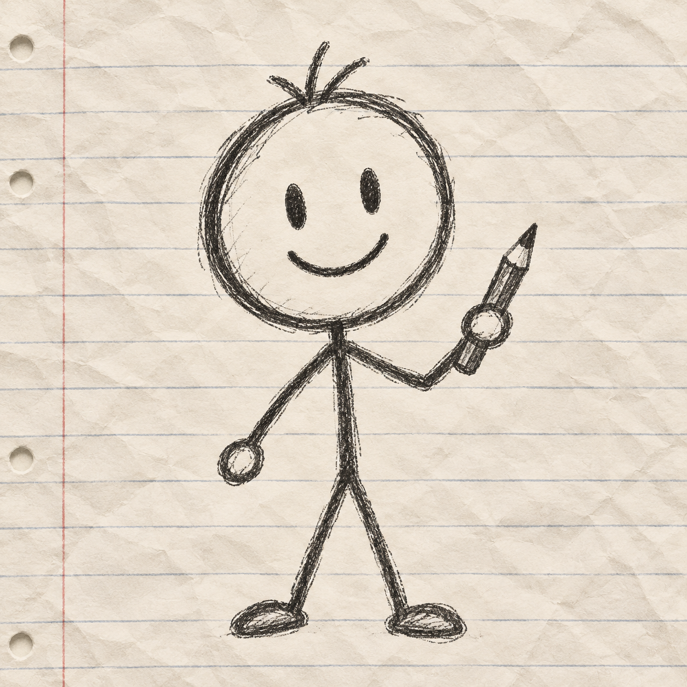
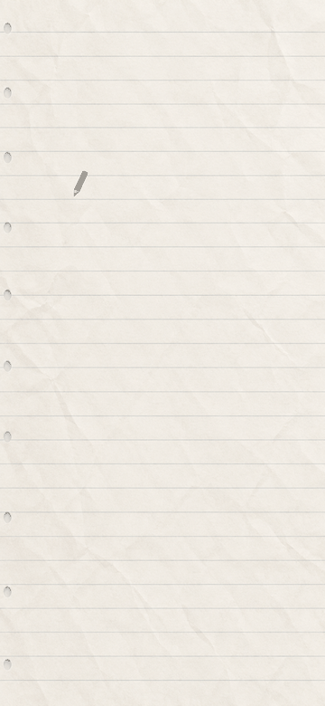
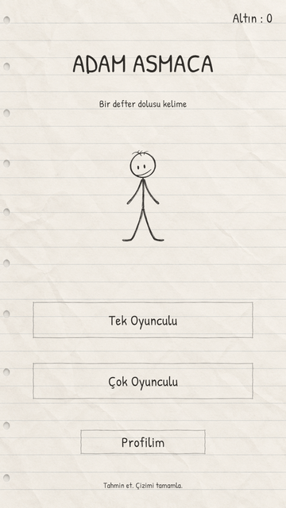
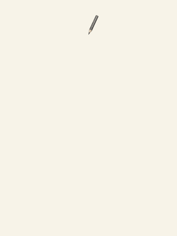
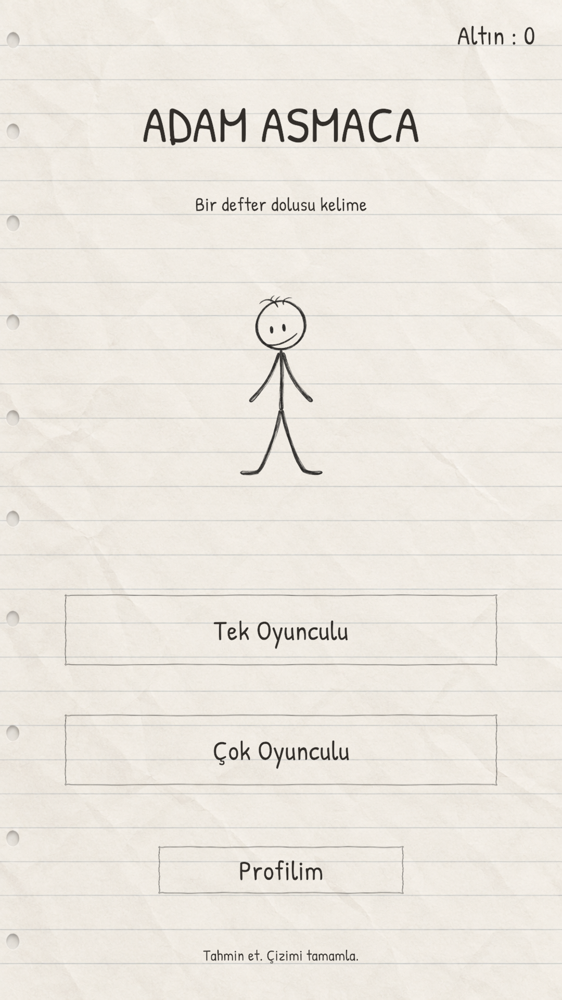
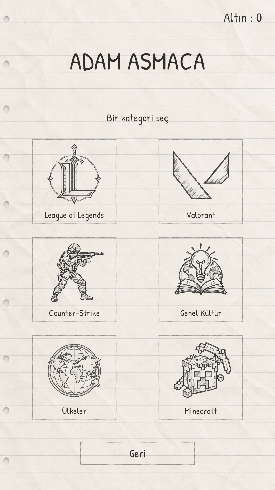
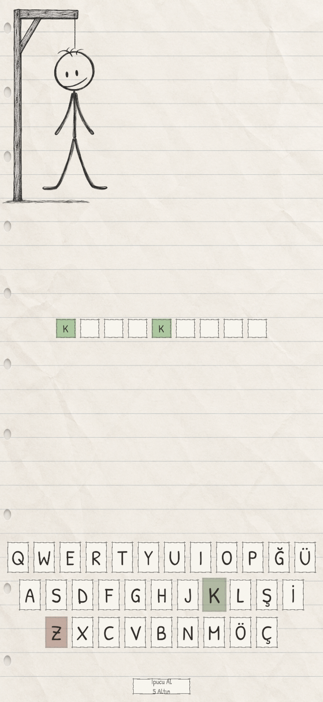
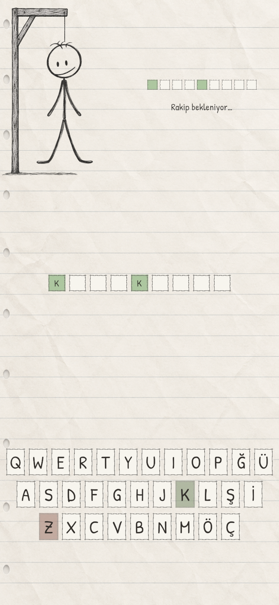

<div align="center">



# Adam Asmaca

### Bir defter dolusu kelime.

Kâğıt üzerine çizilmiş bir dünya, fizik tabanlı bir çubuk adam ve arkadaşlarla kelime mücadelesi.

**A notebook-inspired hangman game built with Unity — pencil drawings, 2D physics and online 1v1.**


[Önizleme](#önizleme) · [Oynanış](#oynanış) · [Teknik yapı](#teknik-yapı) · [Projeyi çalıştır](#projeyi-çalıştır)

</div>

---

## Önizleme

Her şey bir kalem çizgisiyle başlıyor. Menü kâğıda çiziliyor, sayfa değişirken silgi devreye giriyor ve her yanlış tahminde çubuk adamın yeni bir parçası oluşuyor.

<table>
  <tr>
    <th>Kalemle açılan menü</th>
    <th>Silgili sayfa geçişi</th>
    <th>Çizilen karakter</th>
  </tr>
  <tr>
    <td valign="top" align="center"></td>
    <td valign="top" align="center"></td>
    <td valign="top" align="center"></td>
  </tr>
</table>

### Defterin sayfaları

<table>
  <tr>
    <th>Ana menü</th>
    <th>Kategori seçimi</th>
    <th>Tek oyunculu</th>
  </tr>
  <tr>
    <td valign="top" align="center"></td>
    <td valign="top" align="center"></td>
    <td valign="top" align="center"></td>
  </tr>
</table>

<details>
<summary>Çok oyunculu ekranı göster</summary>

<p align="center">
  
</p>

</details>

*Görseller Unity'deki oyun ve önizleme sahnelerinden alınmıştır. Karakter GIF'i çizim mekaniğinin atölye önizlemesidir.*

## Oynanış

Bir kategori seç, harfleri tahmin et ve kelimeyi çubuk adam tamamlanmadan bul. Doğru harfler kelime kutularını açar; yanlış harfler karaktere yeni bir çizgi ekler.

- **Altı kategori:** League of Legends, Valorant, Counter-Strike, Genel Kültür, Ülkeler ve Minecraft.
- **Fizik tabanlı karakter:** tamamlanan parçalar sallanır, sürüklenebilir ve ekran kenarlarıyla çarpışır.
- **Kalem ve kâğıt hissi:** grafit dokuları, doğal kalem sesi, temas noktasında basma efekti ve silgili geçişler.
- **Tek oyunculu:** hesap açmadan misafir olarak oynama.
- **Çevrimiçi 1v1:** rastgele eşleşme veya arkadaşına kategori seçerek özel maç daveti gönderme.
- **Hesap ve arkadaşlık:** kayıt/giriş, profil, oyuncu ID'si, arkadaş istekleri ve isteğe bağlı “Beni hatırla”.
- **İsteğe bağlı yapay zekâ ipuçları:** Gemini entegrasyonu; ayrı servis yapılandırması gerektirir.

## Teknik yapı

Görsel anlatım ile oyun mantığı ayrı bileşenlerde tutuluyor. Unity 2D fiziği karakteri yönetirken, çizim efekti yeni parçanın görünümünü tamamlayıp fiziğe katılmasını sağlıyor.

| Alan | Kullanılan yapı |
|---|---|
| Motor ve görüntüleme | Unity 6, Universal Render Pipeline, C# |
| Karakter | `RagdollController`, `HangmanPart`, `PencilDrawEffect`, `PaperScreenBounds` |
| Menü ve etkileşim | `PaperMenuIntro`, `PaperPressFeedback`, `PaperPageTransition` |
| Çok oyunculu | Photon PUN 2, PlayFab kimliğiyle custom authentication |
| Hesap ve sosyal sistem | `AccountService`, `FriendsService`, `FriendMatchService` |
| Sunucu işlemleri | PlayFab Classic CloudScript; `Backend/PlayFab/social.js` |
| Oturumu hatırlama | Android Keystore / Windows DPAPI ile yerel cihaz giriş kaydı |

### Proje düzeni

```text
Assets/
  Scripts/          Oynanış, fizik, arayüz ve hesap servisleri
  Scenes/           Menü, tek oyunculu, çok oyunculu ve çizim atölyesi
  Editor/           Varlık üretimi ve doğrulama araçları
  Plugins/Android/  Android cihaz giriş kaydının şifrelenmesi
  Sprites/          Karakalem karakter ve kâğıt teması
  Audio/            Kalem sürtünme kayıtları
Backend/PlayFab/    Arkadaşlık ve maç daveti CloudScript'i
Docs/              Görseller, tasarım notları ve kurulum örnekleri
Tools/             Git paylaşımı için metin tabanlı anahtar kontrolü
```

## Projeyi çalıştır

1. Repoyu klonla:

   ```bash
   git clone https://github.com/Lenssz/Adam-Asmaca.git
   ```

2. Unity Hub'dan projeyi **Unity 6000.3.6f1** ile aç. Android build için **Android Build Support**, SDK, NDK ve OpenJDK modüllerini ekle.
3. `Assets/Scenes/SampleScene.unity` sahnesini açıp **Play** düğmesine bas. Tek oyunculu mod hesap gerektirmez.
4. Çevrimiçi özellikler için kendi Photon ve PlayFab yapılandırmanı ekle. Anahtarsız ayar örnekleri [Docs/PublicSetup](Docs/PublicSetup) klasöründedir; dosya yolları ve kopyalama adımları [kurulum notlarında](Docs/GITHUB_GUVENLIK.md#yerel-oyun-ve-temiz-klon-kurulumu) açıklanır.
5. Arkadaşlık için [CloudScript dosyasını](Backend/PlayFab/social.js) kendi PlayFab projenin Classic CloudScript bölümünde yayımla; Photon–PlayFab custom authentication bağlantısını yapılandır. Ayrıntılar [hesap ve 1v1 notlarında](Docs/Accounts/README.md) bulunur.

**Yerel servis ayarları repoya dahil değildir.** Gemini ipuçları yapılandırma olmadan kullanılamaz. Dağıtılacak bir uygulamada Gemini anahtarını APK içinde taşımak yerine sunucu üzerinden çağrı yapılmalıdır.

### Android build

Build sahneleri sırasıyla `SampleScene`, `GAMESCENE` ve `MultiplayerGameScene` olarak tanımlıdır. Proje Android ARM64 hedefini kullanır. Android build sürecine ilişkin notlar [burada](Docs/ANDROID_BUILD_FIX.md) yer alır.

## Geliştirme durumu

Proje geliştirme aşamasındadır. Çizim, fizik ve arayüz için Unity doğrulama araçları; arkadaşlık CloudScript'i için yerel testler bulunur. Android APK üretimi ve iki Photon istemcisinin özel odaya katılması doğrulanmıştır. Gerçek telefonlarda dokunma, performans ve iki cihazlı uçtan uca maç kontrolleri ayrıca yapılmalıdır.

CloudScript testleri Node.js ile çalıştırılabilir:

```bash
node Backend/PlayFab/social.test.cjs
```

## Kaynaklar ve teşekkürler

- **Patrick Hand:** el yazısı fontu, SIL Open Font License — [lisans](Assets/Fonts/Paper/OFL.txt).
- **Kalem kayıtları:** NachtmahrTV ve damsur, CC0 — [kaynak bilgileri](Assets/Audio/Pencil/SOURCE-LICENSE.txt).
- **Unity, Photon ve PlayFab:** motor ve çevrimiçi servis altyapısı; ilgili SDK'ların lisansları geçerlidir.
- Kategori adları ve ilgili markalar kendi sahiplerine aittir; proje bu markaların resmî ürünü değildir.

---

<div align="center">

**Tahmin et. Çizimi tamamla.**

[Lenssz](https://github.com/Lenssz) tarafından geliştiriliyor.

</div>
